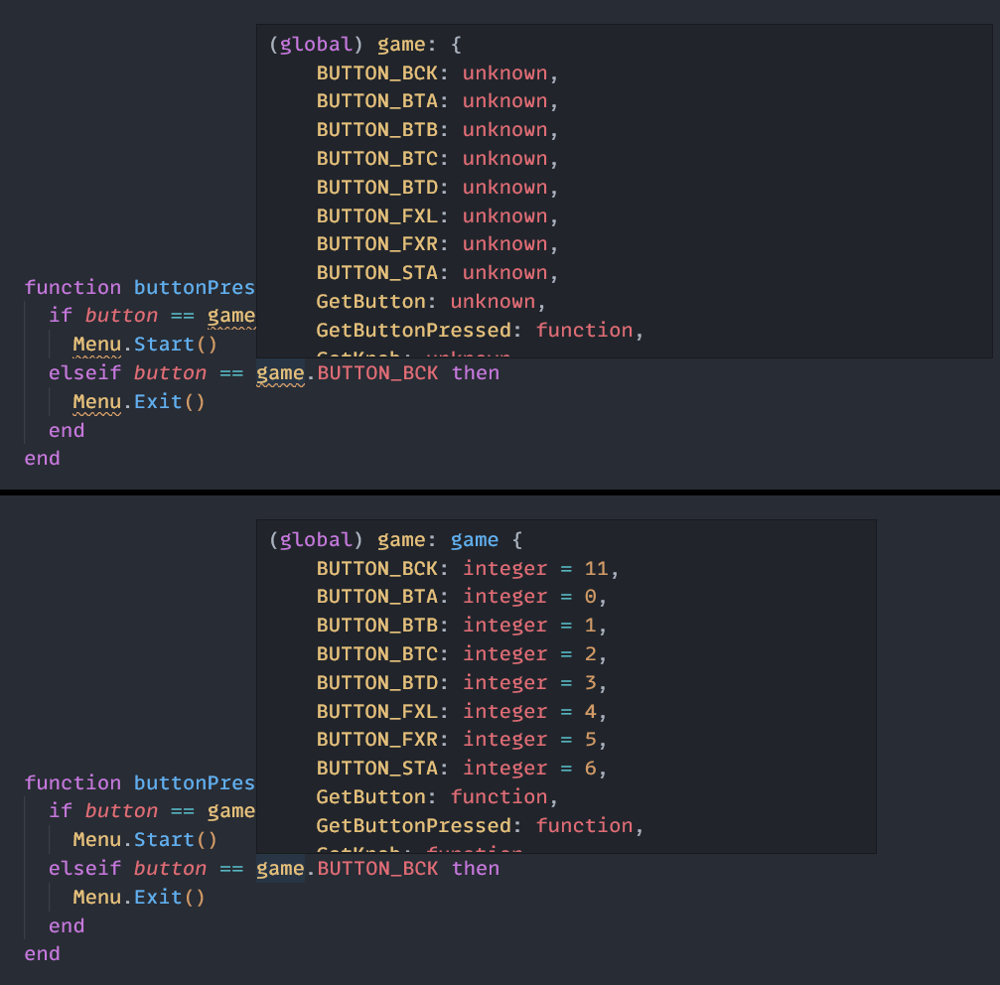

## Skinning API Documentation for [Unnamed SDVX Clone](https://github.com/Drewol/unnamed-sdvx-clone)

Created in part with reference to the [official skinning documentation](https://unnamed-sdvx-clone.readthedocs.io/en/latest/index.html).

For use with this VS Code [extension](https://marketplace.visualstudio.com/items?itemName=sumneko.lua).

Enables autocompletion, function signatures, hover hints, etc. for USC's skinning functions and tables.

